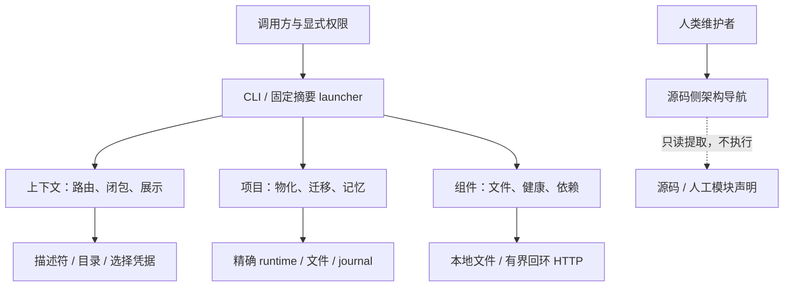

# APG 实现架构

Status: mixed — 静态依赖/锚点由检查器验证；职责、主流程和边界由人维护。
Scope: 本源码仓库；不宣称完整跨语言调用图或生产部署拓扑。

## 系统边界

APG 提供治理内容、精确上下文、声明校验、拥有字节的项目物化/迁移和本机组件观察。
调用方持有操作权限；角色、描述符、记忆、架构图和组件 `available` 均不能授予权限。

## 模块地图与职责

所有纳入扫描的 `lib/`、`scripts/` 和 `tools/architecture/` 源文件必须唯一归属一个模块。
人工事实源是 [modules.json](modules.json)；逐模块卡片、静态依赖、入口与测试由
[生成入口](generated/INDEX.md) 展示。禁止另建一份手工文件清单。

重点边界：

- CLI 分派组件命令，但不再拥有组件依赖或单实例判定。
- `components` 分成记录/文件验证、HTTP 适配器和最终状态编排。
- `context-presentation` 只负责展示；`context` 仍拥有路由/预算编译。
- `generation-state` 拥有本机私有选择状态；provider 保留兼容导出，不再实现这些状态操作。
- `files` 拥有排他原子替换与可选 fsync；各业务仍拥有自己的快照、锁域、journal、恢复不变量。
- 导航工具只依赖 Node 内置模块，不依赖 APG 初始化、发行包或外部索引服务。

## 依赖规则

`modules.json.allowed_dependencies` 是被审查的允许列表；`architecture check` 校验
实际静态导入不越界，文件级和模块级均无循环。新增依赖必须说明理由后调整声明，不能
只为让测试通过而放宽整个允许列表。动态导入、子进程与 shell/Python 调用未被证明。

## 数据与副作用

| 数据/行为 | 所有者 | 写入与失败边界 |
|---|---|---|
| 通用治理内容、catalog、manifest | 内容与发行工具 | 源变动后显式重建；精确摘要，不猜 latest |
| descriptor/root/guide tree | 项目与事务模块 | 审核前像、拥有字节、锁与恢复；冲突显式失败 |
| generation key/handles | generation-state | 机器私有状态，不进入可移植描述符 |
| 组件文件/服务 | 外部所有者；APG 仅观察 | 默认不下载、不启动；probe 仅回环 |
| 人工模块声明与契约 | 项目维护者 | 可审查的设计意图，不自动从推断升级 |
| 导航派生物 | 架构作者工具 | 只由 build 更新；check/locate/impact 不写入 |

项目索引、架构、模块契约、验证矩阵与记忆均不进入通用治理 catalog 或发行包。
导航派生物不进入 bootstrap，不增加每轮治理上下文。

## 已知限制与后续方向

这是渐进解耦，不宣称已经完成所有用例层提取。CLI 仍拥有部分项目事务编排，context
仍包含分类/预算逻辑；只有在新增测试或实际维护成本证明需要时继续拆分。

导航的流程图是人工声明的主路径，不能证明运行时分支；锚点只验证命名声明位置。
第二个真实消费项目尚未验收，所以目前是仓内独立作者模块，不单独发布或承诺跨语言完整性。
