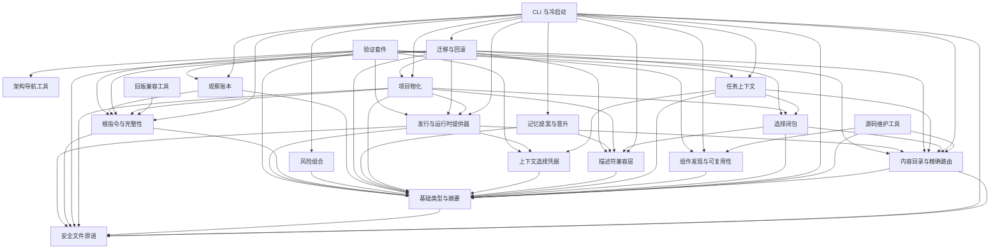

# APG 架构导航

> 自动生成；请修改 `docs/architecture/modules.json` 或源码后重新 build。图是导航，不授予权限、不替代契约；声明流程不是自动证明的调用链。

证据摘要：`sha256:10ad2e7f51e019275faea62e1b701cbae2f2ba57d39c4b01d2acf8ff1f99161e`

## 模块地图

箭头表示静态 ESM 依赖，不表示运行顺序。

## 任务入口

| 模块 | 职责 | 导航卡片 |
|---|---|---|
| 架构导航工具 | 从声明和静态代码事实生成导航、定位和改动说明 | [architecture](architecture.md) |
| 源码维护工具 | 验证路由、暂存组件和过滤本地索引噪声 | [author-tools](author-tools.md) |
| 内容目录与精确路由 | 索引治理章节并校验路由预算 | [catalog](catalog.md) |
| CLI 与冷启动 | 解析命令、选择用例和校验固定运行时 | [cli](cli.md) |
| 选择闭包 | 构造所选角色和文档的有界内容视图 | [closure](closure.md) |
| 组件发现与可复用性 | 文件完整性、回环健康探测和最终依赖判定 | [components](components.md) |
| 任务上下文 | 任务分类、选路、预算和面向人的展示 | [context](context.md) |
| 描述符兼容层 | 校验 schema 1/2 与变体约束 | [descriptor](descriptor.md) |
| 安全文件原语 | 排他创建、原子替换与可选耐久写入 | [files](files.md) |
| 基础类型与摘要 | 错误、规范序列化、路径与发行文件集合 | [foundation](foundation.md) |
| 上下文选择凭据 | 保存本机 generation 状态并绑定选择票据 | [generation](generation.md) |
| 旧版兼容工具 | 维护旧安装器、根块边界和版本检查入口 | [legacy](legacy.md) |
| 项目物化 | 预览、应用和验证 schema 2 项目状态 | [materialization](materialization.md) |
| 记忆提案与晋升 | 提案、独立审查、晋升和替代 | [memory](memory.md) |
| 迁移与回滚 | 审核计划、拥有字节和恢复边界 | [migration](migration.md) |
| 观察账本 | 追加记录观察到的根指令块变化 | [observation](observation.md) |
| 风险组合 | 单调组合声明的操作效果 | [risk](risk.md) |
| 根指令与完整性 | 生成和验证拥有的根指令块 | [root-policy](root-policy.md) |
| 发行与运行时提供器 | 安装和校验精确摘要的内容及 packed runtime | [runtime](runtime.md) |
| 验证套件 | 使用隔离 fixture 验证公共契约与失败分支 | [verification](verification.md) |

## 分析限制

- dynamic imports and subprocess calls are not dependency edges
- shell/Python files are inventoried, not parsed
- conditional/runtime calls are not a call graph
- JavaScript declaration anchors use a constrained line matcher
