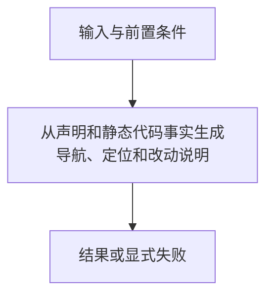

# 架构导航工具

> 自动生成；请修改 `docs/architecture/modules.json` 或源码后重新 build。图是导航，不授予权限、不替代契约；声明流程不是自动证明的调用链。

模块：`architecture`

## 负责 / 不负责
人工契约：[docs/modules/ARCHITECTURE_NAVIGATION.md](../../../docs/modules/ARCHITECTURE_NAVIGATION.md)

从声明和静态代码事实生成导航、定位和改动说明

不负责：执行被分析源码、完整调用图或治理权威

## 改动入口

| 源码位置 | 适合修改什么 |
|---|---|
| [`tools/architecture/model.mjs#inspectArchitecture`](../../../tools/architecture/model.mjs#L61) | 所有权、依赖、锚点检查 |
| [`tools/architecture/model.mjs#changeImpact`](../../../tools/architecture/model.mjs#L134) | 保守改动影响 |
| [`tools/architecture/render.mjs#renderArchitecture`](../../../tools/architecture/render.mjs#L7) | 模块卡片和流程图 |
| [`scripts/architecture.mjs#main`](../../../scripts/architecture.mjs#L7) | 离线作者命令 |

## 声明性主流程

流程依据：人工模块声明；锚点存在性由检查器验证，分支和时序仍需核对实现与测试。
- 从声明和静态代码事实生成导航、定位和改动说明 → [`tools/architecture/model.mjs#inspectArchitecture`](../../../tools/architecture/model.mjs#L61)

## 边界与验证

实际依赖：无内部静态依赖

允许依赖：仅 Node 内置模块

建议验证（只显示，不自动执行）：
- [`scripts/test-architecture.mjs`](../../../scripts/test-architecture.mjs)

## 本模块文件

- [`scripts/architecture.mjs`](../../../scripts/architecture.mjs)
- [`tools/architecture/model.mjs`](../../../tools/architecture/model.mjs)
- [`tools/architecture/parse-esm.mjs`](../../../tools/architecture/parse-esm.mjs)
- [`tools/architecture/render.mjs`](../../../tools/architecture/render.mjs)
