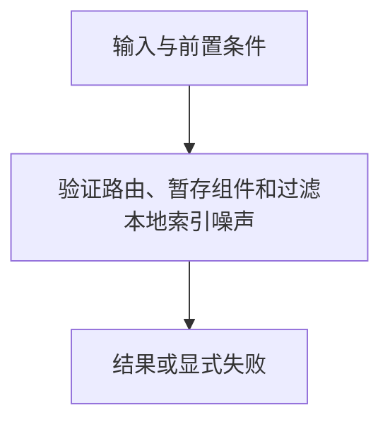

# 源码维护工具

> 自动生成；请修改 `docs/architecture/modules.json` 或源码后重新 build。图是导航，不授予权限、不替代契约；声明流程不是自动证明的调用链。

模块：`author-tools`

## 负责 / 不负责
人工契约：[docs/architecture/OVERVIEW.md](../../../docs/architecture/OVERVIEW.md)

验证路由、暂存组件和过滤本地索引噪声

不负责：进入默认运行时或自动抓取组件

## 改动入口

| 源码位置 | 适合修改什么 |
|---|---|
| [`scripts/build-component-store.mjs#main`](../../../scripts/build-component-store.mjs#L97) | 显式来源的本机组件暂存 |
| [`scripts/validate-routing.mjs`](../../../scripts/validate-routing.mjs#L1) | 路由注册表验证 |

## 声明性主流程

流程依据：人工模块声明；锚点存在性由检查器验证，分支和时序仍需核对实现与测试。
- 验证路由、暂存组件和过滤本地索引噪声 → [`scripts/build-component-store.mjs#main`](../../../scripts/build-component-store.mjs#L97)

## 边界与验证

实际依赖：[catalog](catalog.md)、[components](components.md)、[foundation](foundation.md)

允许依赖：`foundation`、`components`、`catalog`

建议验证（只显示，不自动执行）：
- [`scripts/test-component-store.mjs`](../../../scripts/test-component-store.mjs)
- [`scripts/test-mnemon-index-filter.mjs`](../../../scripts/test-mnemon-index-filter.mjs)

## 本模块文件

- [`scripts/build-component-store.mjs`](../../../scripts/build-component-store.mjs)
- [`scripts/git-filter-mnemon-index.mjs`](../../../scripts/git-filter-mnemon-index.mjs)
- [`scripts/setup-git-filters.sh`](../../../scripts/setup-git-filters.sh)
- [`scripts/validate-routing.mjs`](../../../scripts/validate-routing.mjs)
