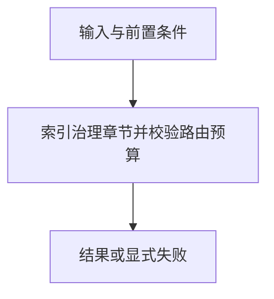

# 内容目录与精确路由

> 自动生成；请修改 `docs/architecture/modules.json` 或源码后重新 build。图是导航，不授予权限、不替代契约；声明流程不是自动证明的调用链。

模块：`catalog`

## 负责 / 不负责
人工契约：[docs/architecture/OVERVIEW.md](../../../docs/architecture/OVERVIEW.md)

索引治理章节并校验路由预算

不负责：运行时权限或语义检索

## 改动入口

| 源码位置 | 适合修改什么 |
|---|---|
| [`lib/catalog.mjs#buildCatalog`](../../../lib/catalog.mjs#L125) | 章节目录生成 |
| [`lib/context-routes.mjs#validateContextRoutes`](../../../lib/context-routes.mjs#L39) | 角色章节与预算约束 |

## 声明性主流程

流程依据：人工模块声明；锚点存在性由检查器验证，分支和时序仍需核对实现与测试。
- 索引治理章节并校验路由预算 → [`lib/catalog.mjs#buildCatalog`](../../../lib/catalog.mjs#L125)

## 边界与验证

实际依赖：[files](files.md)、[foundation](foundation.md)

允许依赖：`foundation`、`files`

建议验证（只显示，不自动执行）：
- [`scripts/test-determinism.mjs`](../../../scripts/test-determinism.mjs)
- [`scripts/validate-routing.mjs`](../../../scripts/validate-routing.mjs)
- [`scripts/test-v2.mjs`](../../../scripts/test-v2.mjs)

## 本模块文件

- [`lib/catalog.mjs`](../../../lib/catalog.mjs)
- [`lib/context-routes.mjs`](../../../lib/context-routes.mjs)
