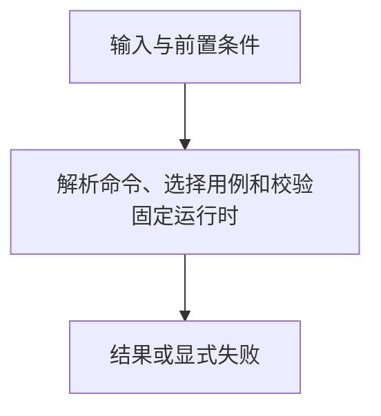

# CLI 与冷启动

> 自动生成；请修改 `docs/architecture/modules.json` 或源码后重新 build。图是导航，不授予权限、不替代契约；声明流程不是自动证明的调用链。

模块：`cli`

## 负责 / 不负责
人工契约：[docs/architecture/OVERVIEW.md](../../../docs/architecture/OVERVIEW.md)

解析命令、选择用例和校验固定运行时

不负责：组件领域判定、上下文展示实现

## 改动入口

| 源码位置 | 适合修改什么 |
|---|---|
| [`scripts/apg.mjs#main`](../../../scripts/apg.mjs#L843) | 公共命令分派 |
| [`scripts/apg-launcher.mjs#validatePackedRuntime`](../../../scripts/apg-launcher.mjs#L101) | 导入前固定摘要校验 |

## 声明性主流程

流程依据：人工模块声明；锚点存在性由检查器验证，分支和时序仍需核对实现与测试。
- 解析命令、选择用例和校验固定运行时 → [`scripts/apg.mjs#main`](../../../scripts/apg.mjs#L843)

## 边界与验证

实际依赖：[catalog](catalog.md)、[components](components.md)、[context](context.md)、[descriptor](descriptor.md)、[files](files.md)、[foundation](foundation.md)、[materialization](materialization.md)、[memory](memory.md)、[migration](migration.md)、[observation](observation.md)、[risk](risk.md)、[root-policy](root-policy.md)、[runtime](runtime.md)

允许依赖：`foundation`、`files`、`catalog`、`descriptor`、`root-policy`、`runtime`、`generation`、`context`、`materialization`、`migration`、`components`、`memory`、`observation`、`risk`

建议验证（只显示，不自动执行）：
- [`scripts/test-boundary.mjs`](../../../scripts/test-boundary.mjs)
- [`scripts/test-v2.mjs`](../../../scripts/test-v2.mjs)
- [`scripts/test-v3.mjs`](../../../scripts/test-v3.mjs)

## 本模块文件

- [`scripts/apg-launcher.mjs`](../../../scripts/apg-launcher.mjs)
- [`scripts/apg.mjs`](../../../scripts/apg.mjs)
