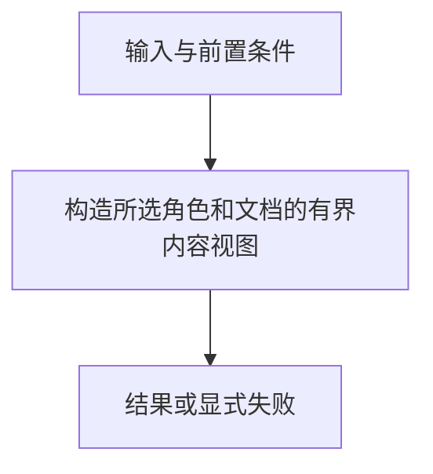

# 选择闭包

> 自动生成；请修改 `docs/architecture/modules.json` 或源码后重新 build。图是导航，不授予权限、不替代契约；声明流程不是自动证明的调用链。

模块：`closure`

## 负责 / 不负责
人工契约：[docs/architecture/OVERVIEW.md](../../../docs/architecture/OVERVIEW.md)

构造所选角色和文档的有界内容视图

不负责：修改目标项目或决定操作权限

## 改动入口

| 源码位置 | 适合修改什么 |
|---|---|
| [`lib/closure.mjs#buildSelectedClosure`](../../../lib/closure.mjs#L58) | 文档选择、依赖和拥有关系 |

## 声明性主流程

流程依据：人工模块声明；锚点存在性由检查器验证，分支和时序仍需核对实现与测试。
- 构造所选角色和文档的有界内容视图 → [`lib/closure.mjs#buildSelectedClosure`](../../../lib/closure.mjs#L58)

## 边界与验证

实际依赖：[catalog](catalog.md)、[descriptor](descriptor.md)、[foundation](foundation.md)

允许依赖：`foundation`、`catalog`、`descriptor`

建议验证（只显示，不自动执行）：
- [`scripts/test-v3.mjs`](../../../scripts/test-v3.mjs)

## 本模块文件

- [`lib/closure.mjs`](../../../lib/closure.mjs)
