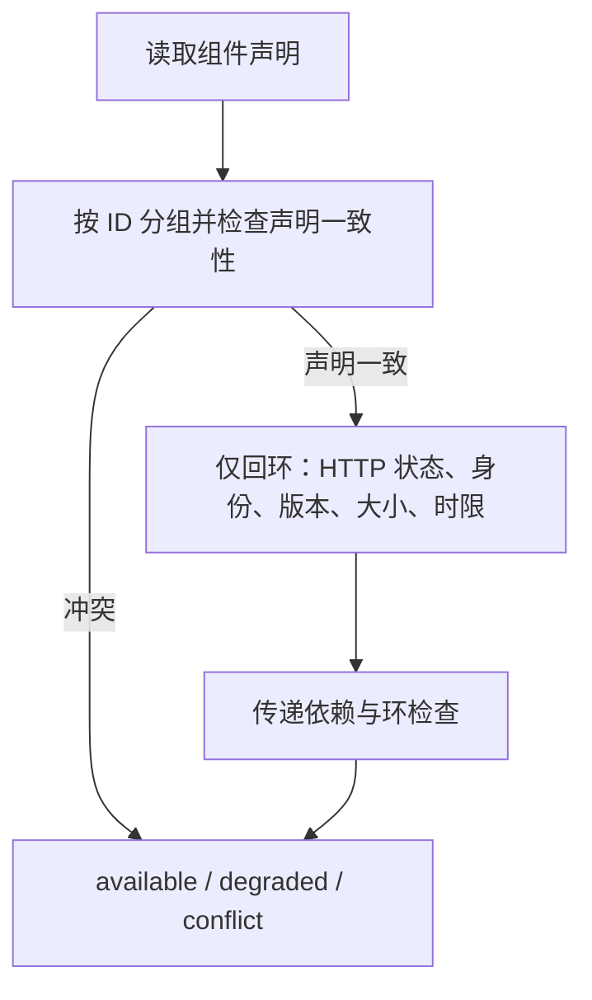

# 组件发现与可复用性

> 自动生成；请修改 `docs/architecture/modules.json` 或源码后重新 build。图是导航，不授予权限、不替代契约；声明流程不是自动证明的调用链。

模块：`components`

## 负责 / 不负责
人工契约：[docs/modules/COMPONENTS.md](../../../docs/modules/COMPONENTS.md)

文件完整性、回环健康探测和最终依赖判定

不负责：下载、启动、停止或修复外部组件

## 改动入口

| 源码位置 | 适合修改什么 |
|---|---|
| [`lib/components.mjs#readStoreEntryRecords`](../../../lib/components.mjs#L186) | 组件记录读取 |
| [`lib/service-probe.mjs#probeService`](../../../lib/service-probe.mjs#L37) | 单次有界健康请求 |
| [`lib/component-resolution.mjs#resolveDependencyGraph`](../../../lib/component-resolution.mjs#L26) | 传递依赖和环 |
| [`lib/component-resolution.mjs#probeComponents`](../../../lib/component-resolution.mjs#L67) | 服务分组、单实例和汇总 |
| [`lib/component-resolution.mjs#verifyComponents`](../../../lib/component-resolution.mjs#L49) | 无网络的文件验证 |

## 声明性主流程

流程依据：人工模块声明；锚点存在性由检查器验证，分支和时序仍需核对实现与测试。
- 读取组件声明 → [`lib/components.mjs#readStoreEntryRecords`](../../../lib/components.mjs#L186)
- 按 ID 分组并检查声明一致性 → [`lib/component-resolution.mjs#probeComponents`](../../../lib/component-resolution.mjs#L67)
- 仅回环：HTTP 状态、身份、版本、大小、时限 → [`lib/service-probe.mjs#probeService`](../../../lib/service-probe.mjs#L37)
- 传递依赖与环检查 → [`lib/component-resolution.mjs#resolveDependencyGraph`](../../../lib/component-resolution.mjs#L26)

## 边界与验证

实际依赖：[foundation](foundation.md)

允许依赖：`foundation`

建议验证（只显示，不自动执行）：
- [`scripts/test-component-store.mjs`](../../../scripts/test-component-store.mjs)
- [`scripts/test-component-regressions.mjs`](../../../scripts/test-component-regressions.mjs)

## 本模块文件

- [`lib/component-resolution.mjs`](../../../lib/component-resolution.mjs)
- [`lib/components.mjs`](../../../lib/components.mjs)
- [`lib/service-probe.mjs`](../../../lib/service-probe.mjs)
