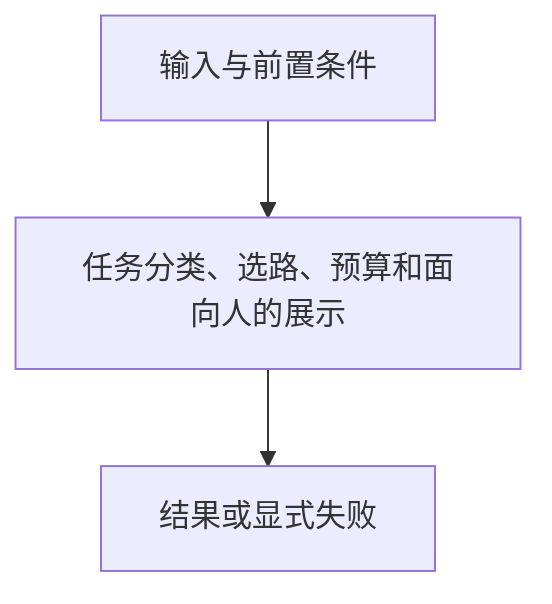

# 任务上下文

> 自动生成；请修改 `docs/architecture/modules.json` 或源码后重新 build。图是导航，不授予权限、不替代契约；声明流程不是自动证明的调用链。

模块：`context`

## 负责 / 不负责
人工契约：[docs/modules/CONTEXT.md](../../../docs/modules/CONTEXT.md)

任务分类、选路、预算和面向人的展示

不负责：物化写入或隐式权限授予

## 改动入口

| 源码位置 | 适合修改什么 |
|---|---|
| [`lib/context.mjs#compileContext`](../../../lib/context.mjs#L391) | 路由和有界加载 |
| [`lib/context-presentation.mjs#renderContext`](../../../lib/context-presentation.mjs#L16) | 人读展示 |
| [`lib/context.mjs#validateContextMatrix`](../../../lib/context.mjs#L567) | 路由矩阵验证 |

## 声明性主流程

流程依据：人工模块声明；锚点存在性由检查器验证，分支和时序仍需核对实现与测试。
- 任务分类、选路、预算和面向人的展示 → [`lib/context.mjs#compileContext`](../../../lib/context.mjs#L391)

## 边界与验证

实际依赖：[catalog](catalog.md)、[closure](closure.md)、[foundation](foundation.md)、[generation](generation.md)

允许依赖：`foundation`、`catalog`、`closure`、`generation`

建议验证（只显示，不自动执行）：
- [`scripts/test-context-choice.mjs`](../../../scripts/test-context-choice.mjs)
- [`scripts/test-v2.mjs`](../../../scripts/test-v2.mjs)
- [`scripts/test-v3.mjs`](../../../scripts/test-v3.mjs)

## 本模块文件

- [`lib/context-errors.mjs`](../../../lib/context-errors.mjs)
- [`lib/context-presentation.mjs`](../../../lib/context-presentation.mjs)
- [`lib/context.mjs`](../../../lib/context.mjs)
