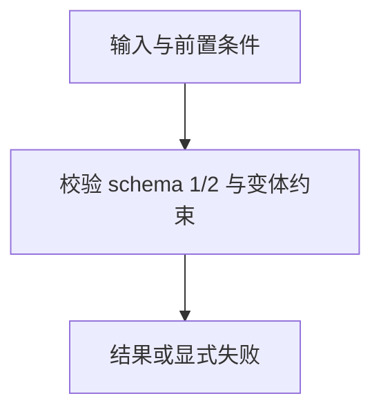

# 描述符兼容层

> 自动生成；请修改 `docs/architecture/modules.json` 或源码后重新 build。图是导航，不授予权限、不替代契约；声明流程不是自动证明的调用链。

模块：`descriptor`

## 负责 / 不负责
人工契约：[docs/architecture/OVERVIEW.md](../../../docs/architecture/OVERVIEW.md)

校验 schema 1/2 与变体约束

不负责：物化或自动修复项目

## 改动入口

| 源码位置 | 适合修改什么 |
|---|---|
| [`lib/descriptor.mjs#validateDescriptor`](../../../lib/descriptor.mjs#L42) | 描述符版本分派 |
| [`lib/descriptor-v3.mjs#validateV3Descriptor`](../../../lib/descriptor-v3.mjs#L89) | schema 2 变体约束 |

## 声明性主流程

流程依据：人工模块声明；锚点存在性由检查器验证，分支和时序仍需核对实现与测试。
- 校验 schema 1/2 与变体约束 → [`lib/descriptor.mjs#validateDescriptor`](../../../lib/descriptor.mjs#L42)

## 边界与验证

实际依赖：[foundation](foundation.md)

允许依赖：`foundation`

建议验证（只显示，不自动执行）：
- [`scripts/test-schema.py`](../../../scripts/test-schema.py)
- [`scripts/test-v2.mjs`](../../../scripts/test-v2.mjs)
- [`scripts/test-v3.mjs`](../../../scripts/test-v3.mjs)

## 本模块文件

- [`lib/descriptor-v3.mjs`](../../../lib/descriptor-v3.mjs)
- [`lib/descriptor.mjs`](../../../lib/descriptor.mjs)
