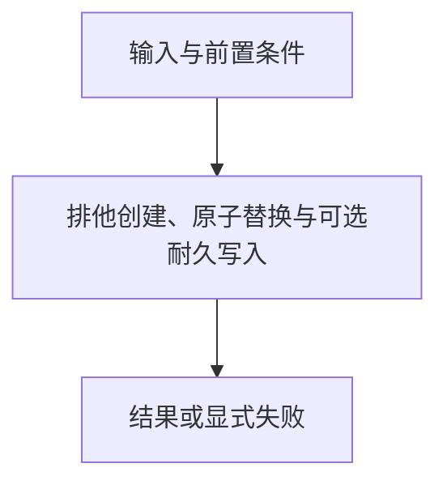

# 安全文件原语

> 自动生成；请修改 `docs/architecture/modules.json` 或源码后重新 build。图是导航，不授予权限、不替代契约；声明流程不是自动证明的调用链。

模块：`files`

## 负责 / 不负责
人工契约：[docs/modules/STORAGE_RUNTIME.md](../../../docs/modules/STORAGE_RUNTIME.md)

排他创建、原子替换与可选耐久写入

不负责：业务事务、权限授予或敌对文件系统隔离

## 改动入口

| 源码位置 | 适合修改什么 |
|---|---|
| [`lib/files.mjs#writeFileAtomic`](../../../lib/files.mjs#L7) | 文件替换与临时文件清理 |

## 声明性主流程

流程依据：人工模块声明；锚点存在性由检查器验证，分支和时序仍需核对实现与测试。
- 排他创建、原子替换与可选耐久写入 → [`lib/files.mjs#writeFileAtomic`](../../../lib/files.mjs#L7)

## 边界与验证

实际依赖：无内部静态依赖

允许依赖：仅 Node 内置模块

建议验证（只显示，不自动执行）：
- [`scripts/test-local-write-safety.mjs`](../../../scripts/test-local-write-safety.mjs)
- [`scripts/test-v3.mjs`](../../../scripts/test-v3.mjs)

## 本模块文件

- [`lib/files.mjs`](../../../lib/files.mjs)
