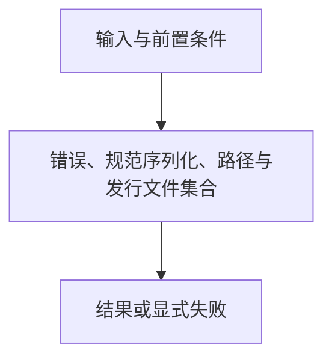

# 基础类型与摘要

> 自动生成；请修改 `docs/architecture/modules.json` 或源码后重新 build。图是导航，不授予权限、不替代契约；声明流程不是自动证明的调用链。

模块：`foundation`

## 负责 / 不负责
人工契约：[docs/modules/STORAGE_RUNTIME.md](../../../docs/modules/STORAGE_RUNTIME.md)

错误、规范序列化、路径与发行文件集合

不负责：路由选择和项目业务状态

## 改动入口

| 源码位置 | 适合修改什么 |
|---|---|
| [`lib/core.mjs#compareCanonical`](../../../lib/core.mjs#L49) | 跨环境规范排序 |
| [`lib/core.mjs#listDistributionFiles`](../../../lib/core.mjs#L186) | 发行文件边界 |
| [`lib/core.mjs#resolveInside`](../../../lib/core.mjs#L99) | 项目相对路径校验 |

## 声明性主流程

流程依据：人工模块声明；锚点存在性由检查器验证，分支和时序仍需核对实现与测试。
- 错误、规范序列化、路径与发行文件集合 → [`lib/core.mjs#compareCanonical`](../../../lib/core.mjs#L49)

## 边界与验证

实际依赖：[files](files.md)

允许依赖：`files`

建议验证（只显示，不自动执行）：
- [`scripts/test-determinism.mjs`](../../../scripts/test-determinism.mjs)
- [`scripts/test-boundary.mjs`](../../../scripts/test-boundary.mjs)
- [`scripts/test-v2.mjs`](../../../scripts/test-v2.mjs)

## 本模块文件

- [`lib/core.mjs`](../../../lib/core.mjs)
- [`lib/crypto.mjs`](../../../lib/crypto.mjs)
