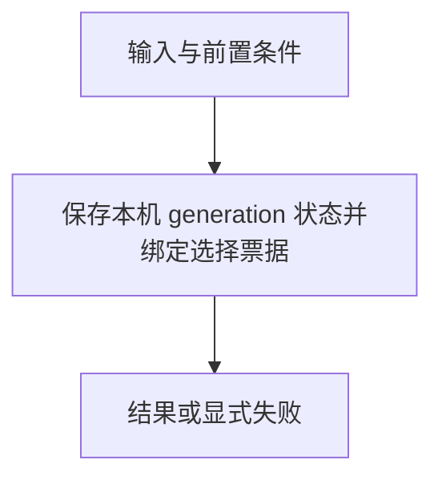

# 上下文选择凭据

> 自动生成；请修改 `docs/architecture/modules.json` 或源码后重新 build。图是导航，不授予权限、不替代契约；声明流程不是自动证明的调用链。

模块：`generation`

## 负责 / 不负责
人工契约：[docs/modules/CONTEXT.md](../../../docs/modules/CONTEXT.md)

保存本机 generation 状态并绑定选择票据

不负责：授予执行权限或选择具体路由

## 改动入口

| 源码位置 | 适合修改什么 |
|---|---|
| [`lib/generation-state.mjs#loadGenerationReference`](../../../lib/generation-state.mjs#L126) | 私有引用读取与完整性 |
| [`lib/context-choice.mjs#verifyCompactChoice`](../../../lib/context-choice.mjs#L23) | 目标、选择和过期绑定 |

## 声明性主流程

流程依据：人工模块声明；锚点存在性由检查器验证，分支和时序仍需核对实现与测试。
- 保存本机 generation 状态并绑定选择票据 → [`lib/generation-state.mjs#loadGenerationReference`](../../../lib/generation-state.mjs#L126)

## 边界与验证

实际依赖：[foundation](foundation.md)

允许依赖：`foundation`

建议验证（只显示，不自动执行）：
- [`scripts/test-context-state.mjs`](../../../scripts/test-context-state.mjs)
- [`scripts/test-context-choice.mjs`](../../../scripts/test-context-choice.mjs)
- [`scripts/test-v3.mjs`](../../../scripts/test-v3.mjs)

## 本模块文件

- [`lib/context-choice.mjs`](../../../lib/context-choice.mjs)
- [`lib/generation-state.mjs`](../../../lib/generation-state.mjs)
