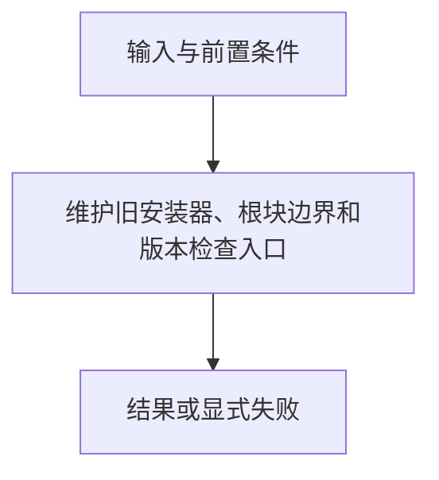

# 旧版兼容工具

> 自动生成；请修改 `docs/architecture/modules.json` 或源码后重新 build。图是导航，不授予权限、不替代契约；声明流程不是自动证明的调用链。

模块：`legacy`

## 负责 / 不负责
人工契约：[docs/architecture/OVERVIEW.md](../../../docs/architecture/OVERVIEW.md)

维护旧安装器、根块边界和版本检查入口

不负责：新项目的默认物化路径

## 改动入口

| 源码位置 | 适合修改什么 |
|---|---|
| [`scripts/install.sh`](../../../scripts/install.sh#L1) | 旧版安装与回退 |
| [`scripts/manage-root-blocks.mjs#markerRange`](../../../scripts/manage-root-blocks.mjs#L23) | 块所有权边界 |

## 声明性主流程

流程依据：人工模块声明；锚点存在性由检查器验证，分支和时序仍需核对实现与测试。
- 维护旧安装器、根块边界和版本检查入口 → [`scripts/install.sh`](../../../scripts/install.sh#L1)

## 边界与验证

实际依赖：[root-policy](root-policy.md)

允许依赖：`root-policy`

建议验证（只显示，不自动执行）：
- [`scripts/test-install.sh`](../../../scripts/test-install.sh)
- [`scripts/test-interop-writers.sh`](../../../scripts/test-interop-writers.sh)

## 本模块文件

- [`scripts/check-update.mjs`](../../../scripts/check-update.mjs)
- [`scripts/install.sh`](../../../scripts/install.sh)
- [`scripts/manage-root-blocks.mjs`](../../../scripts/manage-root-blocks.mjs)
