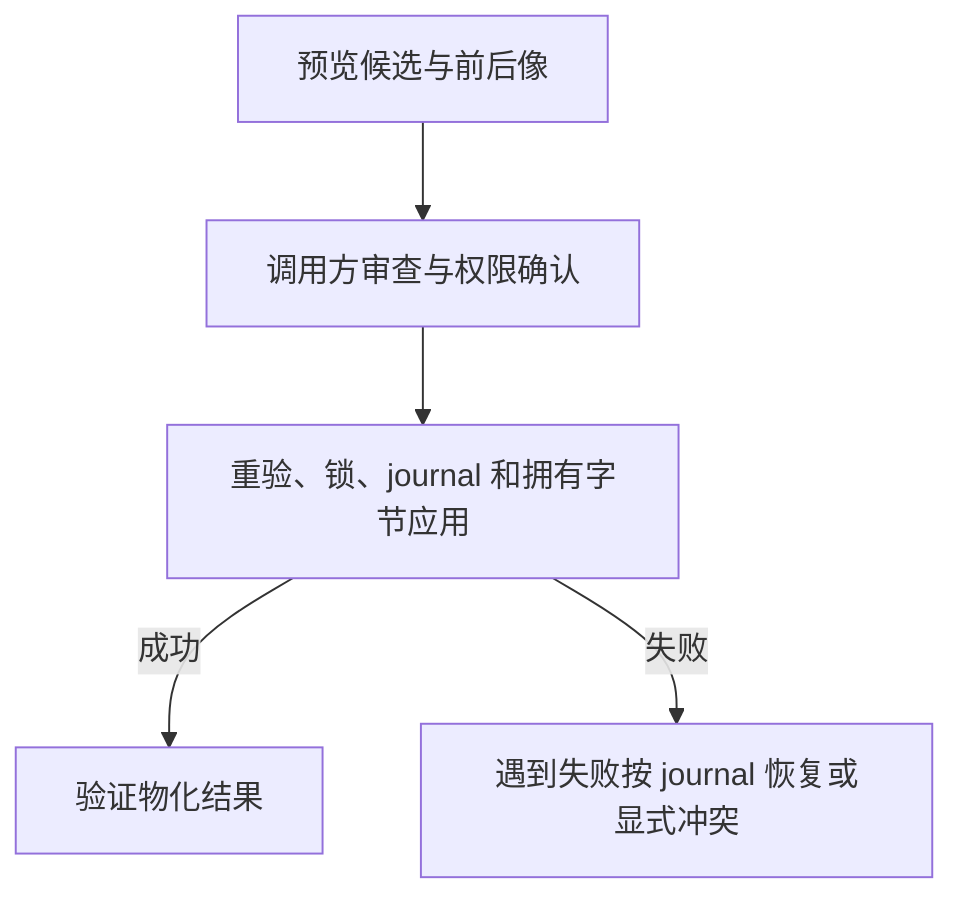

# 项目物化

> 自动生成；请修改 `docs/architecture/modules.json` 或源码后重新 build。图是导航，不授予权限、不替代契约；声明流程不是自动证明的调用链。

模块：`materialization`

## 负责 / 不负责
人工契约：[docs/modules/TRANSACTIONS.md](../../../docs/modules/TRANSACTIONS.md)

预览、应用和验证 schema 2 项目状态

不负责：旧版迁移策略或生产操作

## 改动入口

| 源码位置 | 适合修改什么 |
|---|---|
| [`lib/materializer.mjs#previewMaterialization`](../../../lib/materializer.mjs#L243) | 零写入预览 |
| [`lib/materializer.mjs#applyMaterialization`](../../../lib/materializer.mjs#L330) | 锁、journal、应用与恢复 |
| [`lib/materializer.mjs#validateMaterializedProject`](../../../lib/materializer.mjs#L583) | 物化结果验证 |

## 声明性主流程

流程依据：人工模块声明；锚点存在性由检查器验证，分支和时序仍需核对实现与测试。
- 预览候选与前后像 → [`lib/materializer.mjs#previewMaterialization`](../../../lib/materializer.mjs#L243)
- 重验、锁、journal 和拥有字节应用 → [`lib/materializer.mjs#applyMaterialization`](../../../lib/materializer.mjs#L330)
- 验证物化结果 → [`lib/materializer.mjs#validateMaterializedProject`](../../../lib/materializer.mjs#L583)

## 边界与验证

实际依赖：[closure](closure.md)、[descriptor](descriptor.md)、[files](files.md)、[foundation](foundation.md)、[root-policy](root-policy.md)、[runtime](runtime.md)

允许依赖：`foundation`、`files`、`closure`、`descriptor`、`root-policy`、`runtime`

建议验证（只显示，不自动执行）：
- [`scripts/test-v3.mjs`](../../../scripts/test-v3.mjs)

## 本模块文件

- [`lib/materializer.mjs`](../../../lib/materializer.mjs)
