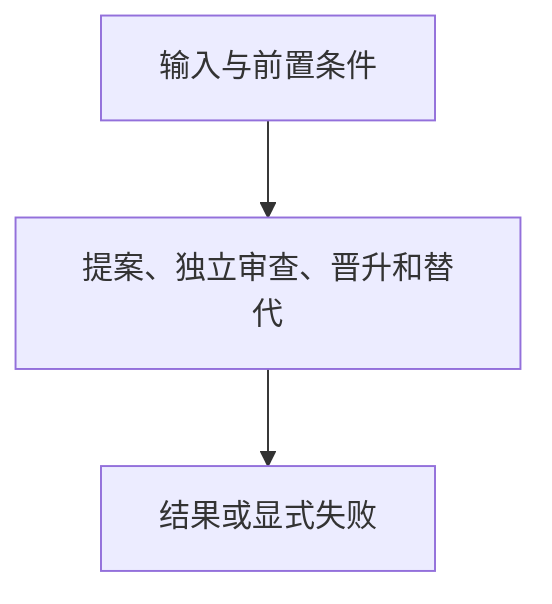

# 记忆提案与晋升

> 自动生成；请修改 `docs/architecture/modules.json` 或源码后重新 build。图是导航，不授予权限、不替代契约；声明流程不是自动证明的调用链。

模块：`memory`

## 负责 / 不负责
人工契约：[docs/architecture/OVERVIEW.md](../../../docs/architecture/OVERVIEW.md)

提案、独立审查、晋升和替代

不负责：索引或检索引擎

## 改动入口

| 源码位置 | 适合修改什么 |
|---|---|
| [`lib/memory.mjs#proposeMemory`](../../../lib/memory.mjs#L55) | 创建提案 |
| [`lib/memory.mjs#promoteMemory`](../../../lib/memory.mjs#L97) | 审查后的拥有字节写入 |

## 声明性主流程

流程依据：人工模块声明；锚点存在性由检查器验证，分支和时序仍需核对实现与测试。
- 提案、独立审查、晋升和替代 → [`lib/memory.mjs#proposeMemory`](../../../lib/memory.mjs#L55)

## 边界与验证

实际依赖：[descriptor](descriptor.md)、[foundation](foundation.md)

允许依赖：`foundation`、`descriptor`

建议验证（只显示，不自动执行）：
- [`scripts/test-v2.mjs`](../../../scripts/test-v2.mjs)

## 本模块文件

- [`lib/memory.mjs`](../../../lib/memory.mjs)
