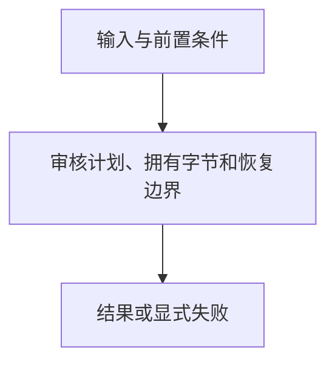

# 迁移与回滚

> 自动生成；请修改 `docs/architecture/modules.json` 或源码后重新 build。图是导航，不授予权限、不替代契约；声明流程不是自动证明的调用链。

模块：`migration`

## 负责 / 不负责
人工契约：[docs/modules/TRANSACTIONS.md](../../../docs/modules/TRANSACTIONS.md)

审核计划、拥有字节和恢复边界

不负责：任意删除用户文件或自动升级到 latest

## 改动入口

| 源码位置 | 适合修改什么 |
|---|---|
| [`lib/migration.mjs#planMigration`](../../../lib/migration.mjs#L91) | 旧版迁移预览 |
| [`lib/migration-v3.mjs#applyV2ToV3Migration`](../../../lib/migration-v3.mjs#L157) | schema 1 到 2 的审核应用 |
| [`lib/migration-v3.mjs#rollbackV3Migration`](../../../lib/migration-v3.mjs#L355) | 冲突检查与恢复 |

## 声明性主流程

流程依据：人工模块声明；锚点存在性由检查器验证，分支和时序仍需核对实现与测试。
- 审核计划、拥有字节和恢复边界 → [`lib/migration.mjs#planMigration`](../../../lib/migration.mjs#L91)

## 边界与验证

实际依赖：[catalog](catalog.md)、[closure](closure.md)、[descriptor](descriptor.md)、[files](files.md)、[foundation](foundation.md)、[materialization](materialization.md)、[root-policy](root-policy.md)、[runtime](runtime.md)

允许依赖：`foundation`、`files`、`descriptor`、`root-policy`、`runtime`、`materialization`、`closure`、`catalog`

建议验证（只显示，不自动执行）：
- [`scripts/test-v2.mjs`](../../../scripts/test-v2.mjs)
- [`scripts/test-v3.mjs`](../../../scripts/test-v3.mjs)

## 本模块文件

- [`lib/migration-v3.mjs`](../../../lib/migration-v3.mjs)
- [`lib/migration.mjs`](../../../lib/migration.mjs)
