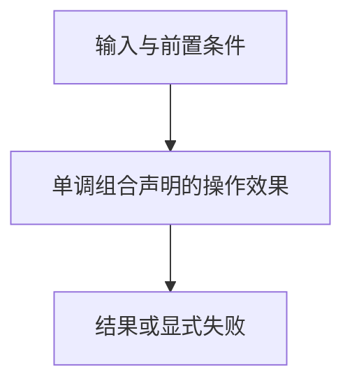

# 风险组合

> 自动生成；请修改 `docs/architecture/modules.json` 或源码后重新 build。图是导航，不授予权限、不替代契约；声明流程不是自动证明的调用链。

模块：`risk`

## 负责 / 不负责
人工契约：[docs/architecture/OVERVIEW.md](../../../docs/architecture/OVERVIEW.md)

单调组合声明的操作效果

不负责：授予权限或执行操作

## 改动入口

| 源码位置 | 适合修改什么 |
|---|---|
| [`lib/risk.mjs#composeRisk`](../../../lib/risk.mjs#L15) | 效果分类与风险合并 |

## 声明性主流程

流程依据：人工模块声明；锚点存在性由检查器验证，分支和时序仍需核对实现与测试。
- 单调组合声明的操作效果 → [`lib/risk.mjs#composeRisk`](../../../lib/risk.mjs#L15)

## 边界与验证

实际依赖：[foundation](foundation.md)

允许依赖：`foundation`

建议验证（只显示，不自动执行）：
- [`scripts/test-v2.mjs`](../../../scripts/test-v2.mjs)

## 本模块文件

- [`lib/risk.mjs`](../../../lib/risk.mjs)
