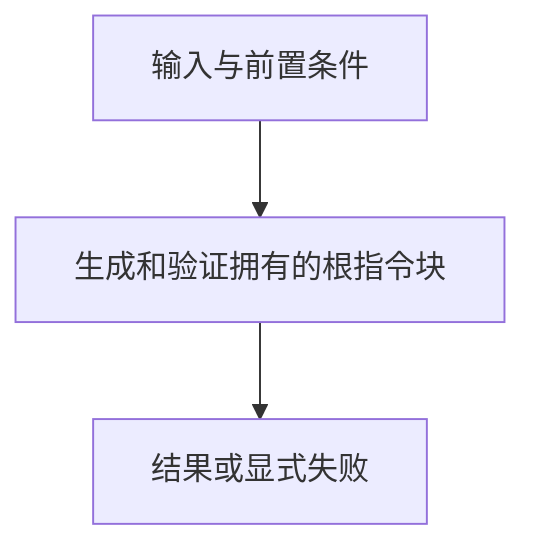

# 根指令与完整性

> 自动生成；请修改 `docs/architecture/modules.json` 或源码后重新 build。图是导航，不授予权限、不替代契约；声明流程不是自动证明的调用链。

模块：`root-policy`

## 负责 / 不负责
人工契约：[docs/architecture/OVERVIEW.md](../../../docs/architecture/OVERVIEW.md)

生成和验证拥有的根指令块

不负责：重写用户拥有的其它字节

## 改动入口

| 源码位置 | 适合修改什么 |
|---|---|
| [`lib/bootstrap.mjs#installBootstrap`](../../../lib/bootstrap.mjs#L106) | schema 1 块安装 |
| [`lib/bootstrap-v3.mjs#inspectV3Root`](../../../lib/bootstrap-v3.mjs#L98) | schema 2 根块验证 |

## 声明性主流程

流程依据：人工模块声明；锚点存在性由检查器验证，分支和时序仍需核对实现与测试。
- 生成和验证拥有的根指令块 → [`lib/bootstrap.mjs#installBootstrap`](../../../lib/bootstrap.mjs#L106)

## 边界与验证

实际依赖：[files](files.md)、[foundation](foundation.md)

允许依赖：`foundation`、`files`

建议验证（只显示，不自动执行）：
- [`scripts/test-local-write-safety.mjs`](../../../scripts/test-local-write-safety.mjs)
- [`scripts/test-install.sh`](../../../scripts/test-install.sh)
- [`scripts/test-v3.mjs`](../../../scripts/test-v3.mjs)

## 本模块文件

- [`lib/block-integrity.mjs`](../../../lib/block-integrity.mjs)
- [`lib/bootstrap-v3.mjs`](../../../lib/bootstrap-v3.mjs)
- [`lib/bootstrap.mjs`](../../../lib/bootstrap.mjs)
- [`lib/root-marker-grammar.mjs`](../../../lib/root-marker-grammar.mjs)
