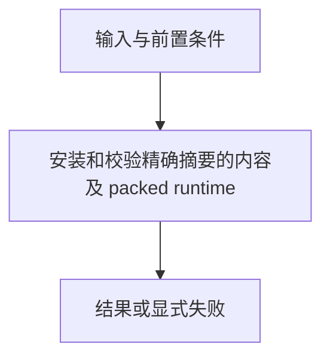

# 发行与运行时提供器

> 自动生成；请修改 `docs/architecture/modules.json` 或源码后重新 build。图是导航，不授予权限、不替代契约；声明流程不是自动证明的调用链。

模块：`runtime`

## 负责 / 不负责
人工契约：[docs/modules/STORAGE_RUNTIME.md](../../../docs/modules/STORAGE_RUNTIME.md)

安装和校验精确摘要的内容及 packed runtime

不负责：解释任务或运行第三方服务

## 改动入口

| 源码位置 | 适合修改什么 |
|---|---|
| [`lib/provider.mjs#openProvider`](../../../lib/provider.mjs#L243) | 提供器选择 |
| [`lib/provider.mjs#buildPackedRuntimeArtifact`](../../../lib/provider.mjs#L122) | 打包内容与运行时 |
| [`lib/provider.mjs#gitExcludeFile`](../../../lib/provider.mjs#L284) | Git 排除写入目标 |

## 声明性主流程

流程依据：人工模块声明；锚点存在性由检查器验证，分支和时序仍需核对实现与测试。
- 安装和校验精确摘要的内容及 packed runtime → [`lib/provider.mjs#openProvider`](../../../lib/provider.mjs#L243)

## 边界与验证

实际依赖：[catalog](catalog.md)、[files](files.md)、[foundation](foundation.md)、[generation](generation.md)

允许依赖：`foundation`、`files`、`catalog`、`generation`

建议验证（只显示，不自动执行）：
- [`scripts/test-v2.mjs`](../../../scripts/test-v2.mjs)
- [`scripts/test-v3.mjs`](../../../scripts/test-v3.mjs)
- [`scripts/test-determinism.mjs`](../../../scripts/test-determinism.mjs)
- [`scripts/test-local-write-safety.mjs`](../../../scripts/test-local-write-safety.mjs)

## 本模块文件

- [`lib/provider.mjs`](../../../lib/provider.mjs)
