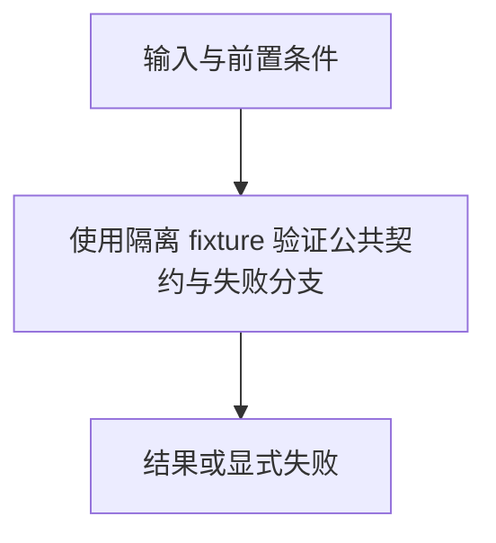

# 验证套件

> 自动生成；请修改 `docs/architecture/modules.json` 或源码后重新 build。图是导航，不授予权限、不替代契约；声明流程不是自动证明的调用链。

模块：`verification`

## 负责 / 不负责
人工契约：[docs/architecture/OVERVIEW.md](../../../docs/architecture/OVERVIEW.md)

使用隔离 fixture 验证公共契约与失败分支

不负责：生产验证或自动发布

## 改动入口

| 源码位置 | 适合修改什么 |
|---|---|
| [`scripts/test-release.sh`](../../../scripts/test-release.sh#L1) | 聚合验证门禁 |
| [`scripts/test-architecture.mjs`](../../../scripts/test-architecture.mjs#L1) | 导航派生物与边界验证 |

## 声明性主流程

流程依据：人工模块声明；锚点存在性由检查器验证，分支和时序仍需核对实现与测试。
- 使用隔离 fixture 验证公共契约与失败分支 → [`scripts/test-release.sh`](../../../scripts/test-release.sh#L1)

## 边界与验证

实际依赖：[architecture](architecture.md)、[catalog](catalog.md)、[components](components.md)、[context](context.md)、[foundation](foundation.md)、[generation](generation.md)、[observation](observation.md)、[root-policy](root-policy.md)、[runtime](runtime.md)

允许依赖：`files`、`foundation`、`descriptor`、`root-policy`、`catalog`、`closure`、`generation`、`runtime`、`context`、`materialization`、`migration`、`components`、`memory`、`observation`、`risk`、`cli`、`legacy`、`author-tools`、`architecture`

建议验证（只显示，不自动执行）：
- [`scripts/test-release.sh`](../../../scripts/test-release.sh)

## 本模块文件

- [`scripts/test-architecture.mjs`](../../../scripts/test-architecture.mjs)
- [`scripts/test-boundary.mjs`](../../../scripts/test-boundary.mjs)
- [`scripts/test-component-regressions.mjs`](../../../scripts/test-component-regressions.mjs)
- [`scripts/test-component-store.mjs`](../../../scripts/test-component-store.mjs)
- [`scripts/test-context-choice.mjs`](../../../scripts/test-context-choice.mjs)
- [`scripts/test-context-state.mjs`](../../../scripts/test-context-state.mjs)
- [`scripts/test-determinism.mjs`](../../../scripts/test-determinism.mjs)
- [`scripts/test-external-provenance.mjs`](../../../scripts/test-external-provenance.mjs)
- [`scripts/test-genericity.mjs`](../../../scripts/test-genericity.mjs)
- [`scripts/test-install.sh`](../../../scripts/test-install.sh)
- [`scripts/test-interop-br.sh`](../../../scripts/test-interop-br.sh)
- [`scripts/test-interop-writers.sh`](../../../scripts/test-interop-writers.sh)
- [`scripts/test-local-write-safety.mjs`](../../../scripts/test-local-write-safety.mjs)
- [`scripts/test-mnemon-index-filter.mjs`](../../../scripts/test-mnemon-index-filter.mjs)
- [`scripts/test-observation-ledger.mjs`](../../../scripts/test-observation-ledger.mjs)
- [`scripts/test-release-pilots.mjs`](../../../scripts/test-release-pilots.mjs)
- [`scripts/test-release.sh`](../../../scripts/test-release.sh)
- [`scripts/test-schema.py`](../../../scripts/test-schema.py)
- [`scripts/test-v2.mjs`](../../../scripts/test-v2.mjs)
- [`scripts/test-v3.mjs`](../../../scripts/test-v3.mjs)
