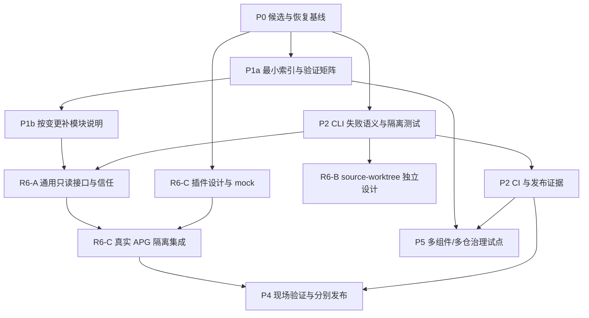

# APG 融合开发路线图

日期：2026-09-08
状态：规划交付；本路线新增批次尚未启动，既有 APG 实现继续作为基线。路线和顺序用于后续任务选择，不构成发布、生产操作或宿主部署授权。
范围：融合大型项目治理研究与 R6 设计校准，保持 APG 核心宿主无关、插件独立开发。

## 1. 目标与当前基线

目标：让 APG 在复杂代码库中帮助 agent 找到正确规则、定位责任与影响范围、按风险推进变更，并用可信证据完成验收。采用既有构建、CI、代码托管和责任目录承担其擅长的执行工作；APG 不成为通用项目管理平台、构建系统或多 Agent 编排器。

当前事实：

- R5 / APG 3.0.4 对 H5/M7/M8 的限定范围已有 Reviewer approved、Verifier pass；仍是未提交、未发布的 dirty source-worktree。
- R5 runtime digest：`sha256:deacad2bbc59057ad72516ceeb48c52b38e74d381f9dcc390fece9c1a2fa2325`。后续任何分发文件变化都产生新候选，不能继承这一批准覆盖新代码。
- H4/M9 和 R6 尚未实现。`plugins/dsh-apg/` 是独立 Git 仓库，只有文档骨架，无可加载插件、远程或发布。
- 旧 H/M/L/D-16 问题仍按 [统一清单](REVIEW_FINDINGS.md) 管理；静态发现保持 provisional，除非获得复现或充分新证据。
- 本文的 P0–P5 是开发阶段，R6-A/B/C 是 R6 工作包，不是新增问题编号，不增加历史问题数量。

依据：[大型项目治理研究](LARGE_PROJECT_GOVERNANCE_REVIEW.md)、[R6 设计校准](R6_DESIGN_REVIEW.md)、[R5 验证交接](R5_VERIFICATION.md)。上游来源见 §9。

### 1.1 结合既有 APG 的增量约束

本次修订优先级：当前实现/可执行测试 → 当前 V2/V3 合同及已接受 ADR → 历史计划中的已交付证据 → 未实施设想。旧计划标记 implemented 不自动证明今日消费者或宿主状态；新的外部研究也不覆盖已有兼容合同。

| 既有资产与依据 | 当前层级 | 本计划处理 |
| --- | --- | --- |
| `lib/catalog.mjs` resolveRoute、`lib/context.mjs` compileContext/validateContextMatrix，`routing/context-routes.jsonl` | 已有确定性路由、section 预算和 R5 全 route 校验 | 直接复用并补失败/效果语义；不另建 classifier、上下文编译器或角色系统 |
| `docs/V2_CONTRACT.md` provider API、`lib/closure.mjs` sourceContentView/packedContentView/buildSelectedClosure | 已有 provider 兼容面、schema-2 选择内容机制 | R6 在现有 loader/closure 上增加明确边界；新 source-worktree 不重写已支持变体 |
| `lib/risk.mjs` composeRisk 与 `docs/V2_CONTRACT.md` risk composition | 已有单调风险合成及 R0–R3 | 复用 tier/required checks，不新建审批等级；本文 R1/R2 路线编号与风险 R1/R2 属不同命名空间 |
| `lib/memory.mjs` propose/review/promote/supersede/purge，`docs/V2_CONTRACT.md` | 已有项目内经验生命周期 | 新计划不另造记忆系统；机器日志不是 promoted memory，项目特定内容不搬进共享 APG store |
| `templates/*.md`，`profiles/CONTENT_PACKAGE.md`、`profiles/MONOREPO_PROJECT.md` | 已有治理模板/规范，部分自宿主实例缺失；不等于机器已强制执行 | P1 补实例/入口，P5 测根/包作用域；不重写模板或新建 monorepo 模型 |
| `scripts/test-release.sh`、`test-schema.py`、`validate-routing.mjs`、`test-install.sh`、`test-v2.mjs`、`test-v3.mjs` | 已有完整组合入口和回归；仍有副作用/退出码/覆盖问题 | P2 修门禁和隔离，不从零搭测试框架；schema 检查实际依赖 Python，不能只声明 Node 即可跑完整 suite |
| `fixtures/pilots/*.json`、`scripts/test-release-pilots.mjs` | 已有两份版本化 pilot 定义，源码仍来自外部 checkout | 保留定义/阈值与有用 oracle，增加自包含合成输入和证据标签；不称“完全没有 fixture” |
| `plans/AGENT_PROJECT_GUIDES_2.0.md` §18–22 | 历史已交付切片、零文件纪律、四个硬 gate 与候选池 | 复用约束和比较指标；不重新建设 2.0 已有能力，不把历史 DSH adapter 用词等同于 R6 插件 |
| `plans/PROVIDER_RUNTIME_EVOLUTION.md` §4–5，ADR-0003 | 较大模式/项目 authority 设想；当前只实现两种 schema-2 variant | R6-B 保持单独最小切片。`project:` authority registry、refresh-authority、channel、其余 variant 和 finalization 继续待设计，不能从文档直接调用 |

已存在 `apg dsh report` 和 README/部分 profile 的 DSH-first 文案：这是兼容债务，不据此引入更多宿主依赖。P1 标记现状与未来方向；R6-A 在行为范围确定后同步文案/泛化接口，保留旧 report 语义，不能只改名称就宣称所有 harness 已支持。

【2026-09-10 R6-A 第一轮已完成，见 cd0aa52 与 ADR-0005】行为范围已由项目所有者确定（通用型核心，DSH 仅经可选插件接入）：DSH-first 文案已泛化，`dsh report` 经 `OBSERVATION_ADAPTERS` seam 降级为 `[compat]` 适配器且输出语义不变，`bootstrap:agents-v2` 取代旧 ID（读别名保留），新增 `scripts/test-genericity.mjs` 门禁。遗留：可执行 DSH 插件（`plugins/dsh-apg` 目前仅脚手架）与 host 侧适配器落地后再评估 compat 适配器弃用时间表。

### 1.2 既有项目的分层复用

| 项目/记录 | 本轮确认范围 | 后续用途与限制 |
| --- | --- | --- |
| APG 自身 | 当前 schema-1 source-worktree、R5 候选与现有脚本 | 最先验证自宿主治理、预算、dirty 基线及新 provider；当前类型仍 content-package，不因 plugins 子仓就自动改为 monorepo |
| `cc-teamwatch` | `fixtures/pilots/small-cli.json` 记录的小 CLI，基线 1.4.3、expected IDs、1650 token 上限 | 保留小项目/低风险零额外治理文件对照；未检查当前外部 checkout，不能称今日已迁移或可跑 |
| `MSP/Core` | `fixtures/pilots/complex-content-package.json`，content-package+agent-governance，基线 1.4.3、1660 token 上限 | 复用复杂内容包的路由/ownership 场景；尚不是已验证的跨仓/多团队治理证据 |
| CadQ、dsh-bench、cc_switch_tiny_switch、dsh-vision-toolkit-windows-edge、onshapescript、taobao-mcp | 仅 `AGENT_PROJECT_GUIDES_2.0.md` §19 候选记录 | 只在缺少特定故障类型的覆盖时选一项；不因在名单中就扫描、迁移、访问真实数据或执行生产工具 |
| `plugins/dsh-apg/` | 独立 Git 文档骨架 | 可作为跨 Git 根边界 fixture 的参考；无运行时代码，不能充当成熟插件验证对象 |

Pilot 运行器将 `APG_PILOT_ROOT`（默认 APG 父目录）中的源码复制到临时目录，并断言 1.4.3 根标记；因此“外部仓存在”不等于符合冻结基线。未来真实复用须确认 owner、源 revision/dirty 状态和可复制范围，避免把不受控 `.git` 指针、敏感配置或缓存随全目录复制带入 fixture。本轮未访问任何这些外部项目。

## 2. 吸收后的产品边界

| 借鉴机制 | 融入 APG 的方式 | 保留的限制 |
| --- | --- | --- |
| OpenSpec：现行规范与变更增量分离 | 重要变更有稳定入口，链接当前契约、变化、任务和证据；历史移出活动清单 | 不强制迁移到 openspec/，不复制第二套权威规范；小修复不需完整文档套件 |
| Spec Kit：原则与跨产物一致性 | 在设计和验收时检查命中的项目原则、需求覆盖及复杂度例外 | 文档检查不是工具权限；不添加多层模板优先级系统 |
| Kubernetes OWNERS：分域责任 | 优先引用现有 OWNERS/CODEOWNERS，区分技术角色、模块负责人和审批者 | 不伪造人员身份；没有真实独立身份就只声称 peer review |
| KEP：风险、成熟度和发布证据 | 大变更明确非目标、兼容矩阵、升级回退和分阶段证据 | 不照搬整套生产问卷到小改动；通过测试不等于已发布 |
| Backstage：组件关系 | 架构索引→模块契约→责任/依赖/检查，按任务加载相关范围 | 不建门户/数据库；已有 catalog 只引用必要信息，不创建人工同步副本 |
| Nx：可执行边界 | 模块契约引用现有 lint/build/CI 检查；APG 核心与插件隔离成为回归断言 | 不强制引入 Nx 或付费 Conformance，不开发跨语言构建图引擎 |
| BMAD：流程按复杂度裁剪 | 小变更简短记录；公共协议、迁移、跨仓和安全变更采用完整审查 | 不以增加 agent 数量代替责任与证据 |

APG 拥有：portable descriptor、内容选择、角色/任务路由、hash/预算、兼容的上下文与 continuation 契约。

宿主插件拥有：宿主 SDK、生命周期、就绪状态、澄清 UI、工具拦截、实际请求观察、子 agent/resume 支持、兼容测试和独立发布。

项目已有平台拥有：人类身份、代码合并权限、CI 执行、生产审批和环境隔离。APG 路由永不授予这些权限。

## 3. 阶段、依赖与交付

### P0：确认可恢复基线与工作隔离

状态：待执行。规模：一个小批次。责任：Maintainer；非作者核对候选边界。

工作：

- 清点已存在的用户修改、R5 文件与新规划文件，建立字节/模式及 Git index 清单，避免混入下一候选。
- 将仍可取得的 R5 关键证据按实际内容保存到受控的本地证据目录，记录原始路径、hash、环境和继承关系；若 `/tmp` 已缺失则记录缺口，需要时重跑，不重建假日志。
- 决定后续开发隔离方式，保留原工作区。若使用临时副本或 worktree，必须包含实际 dirty 候选；仅从 HEAD 建 worktree 会丢失 R5 改动。
- 计划文件与运行时版本分开。提交/打 tag/发布在明确请求后执行，不能为建立基线自动提交所有 dirty 文件。

验收：能明确每个批次的起点和恢复点；原用户文件/index 未被意外修改；证据可定位且不把旧测试写成新运行。

### P1：先在 APG 自身落实治理

对应：M2；治理研究中的责任、索引和追溯建议。状态：待执行。规模：1–2 个有界批次。责任：Maintainer（落地已有模板），Reviewer（边界/权威一致性）。依赖：P0。

产出分两批，已有权威可复用时不新建等价文件：

- **P1a 最小入口**：`docs/INDEX.md`、`docs/verification/MATRIX.md` 和简短 `CONTRIBUTING.md`。直接链接现有 `docs/V2_CONTRACT.md`、`docs/V3_MINIMAL_SLICE.md`、`docs/V2_MIGRATION.md`、`scripts/test-release.sh` 及其子检查；使用 `templates/DOC_INDEX.md`/`VERIFICATION_MATRIX.md`，不重写安装/迁移合同。
- **P1b 按首个行为批次补边界**：先为 P2 CLI/失败语义补真实入口及副作用说明，再按 R6-A/B 需要补 `docs/architecture/OVERVIEW.md` 和关键 `docs/modules/*.md`。三个候选模块为路由/compiler、运行时身份/launcher、生命周期/恢复；数量不是验收目标，可共享清晰权威，不为每目录写一份。
- 复用 CONTENT_PACKAGE profile 的内容/source ownership map 和“日常任务计划默认省略”规则；新契约只记模块特有内容并链接 V2/V3，不复述通用角色/权限条款。
- 下一项高风险变更在已有任务/PR/计划记录内采用 §5 的最小追溯信息；普通 R0/R1 工作保持零新增治理文件，不另建 workflow/证据 schema。

P1a 完成即可开展 P2 对应批次；P1b 仅按依赖模块逐项补齐，不把完整文档体系作为修复缺陷的硬前置。

验收：从任务入口可以找到具体契约与现有检查；链接有效；事实标注 verified/inferred/unknown；每条强边界注明执行检查或“仅文档约束”；无虚构 owner。docs/ 属于 APG 分发白名单，变更后按现有流程更新 catalog/manifest、验证预算并形成新候选，不能声称 R5 digest 保持不变。

### P2：使验证、失败语义与发布可信

对应：H2/H3、R1/R2/R3、M6 的元数据部分，以及映射到这些问题的 D-16/L 项。状态：待执行。责任：Maintainer → Reviewer → Verifier。依赖：P0；P1 可并行，但验收矩阵须随实际变化同步。

按下列顺序拆批，避免一次重写 CLI 和测试体系：

1. **R2/H3：CLI 输入和结果语义。** 先对未知选项、多余 positional、冲突、catalog 陈旧等写负例；确定兼容的非零退出/显式 strict 合同后修复。成功和失败 JSON 与退出码一致。安装 launcher 和直接 CLI 均测试；不能只验证内部 main。
2. **R3：可复现验证基础。** 以现有 `scripts/test-release.sh` 为入口，保留 schema/routing/install/V2/V3/catalog/validate/manifest 组合。先隔离 `test-v2.mjs` 的源 catalog build，再从大文件逐项抽取需加强的行为用例；不为拆文件改行为或更换框架。保留已有 crypto/hash、临时目录、迁移 failpoint 和预暂存 sentinel oracle，独立实现仅补到生产/测试同源的关键薄弱点。`fixtures/pilots` 的定义已版本化但未带外部源码：保留旧定义并另加自包含合成 fixture，不覆盖冻结阈值掩盖回归；输出明确区分 synthetic、外部源码副本、真实宿主任务、skipped。
3. **H2：CI。** 先完成上述最小退出码/隔离要求，再接已有 release 脚本，配置无生产凭据的离线/fixture CI。按脚本核实 Node、Python3、POSIX shell/Git 工具，优先已验证的 Node/Linux 基线；不以新 npm wrapper 隐藏额外依赖。`APG_RUN_REAL_PILOTS=0` 必须显示 skip/范围，默认 CI 不依赖兄弟仓；故意制造失败能使作业失败。检查选择来自矩阵；公共治理/schema/发布变更不能只跑 affected 子集。
4. **R1：发布候选身份。** 本地预览与检查绑定版本、README、manifest、提交/标签关系和必需证据，测试拒绝错配或非目标候选。实现检查不等于本轮会实际发布。
5. **M6：元数据与许可。** 明确包边界、Node engines、分发文件和依赖；LICENSE 类型由权利人选择，不能借鉴上游就自动套用其许可。许可未定不妨碍本地测试，但阻止宣称可对外正式分发。

验收：fresh checkout/明确候选副本可独立运行；至少一个故意失败用例证明每种门禁有效；结果含已跑/失败/跳过、版本和证据；验证命令不意外改候选或暂存区。CI 与本地候选身份匹配，发布/production 操作仍须单独授权。

### P3：拆分 R6，分别设计和实现

#### R6-A：APG 通用自动路由接口与信任边界

对应：C1/C2/C4（R6 设计报告），R6 的 APG 核心部分。依赖：P0、P2 中 CLI 失败语义和隔离测试；P1 提供模块契约。Developer 起草独立 ADR，再分批实现，由 Reviewer/Verifier 验收。

产出：

- 直接复用现有 `provider capabilities/resolve/load` 和 `compileContext`、`validateContextMatrix`、selected content view；只有确实缺少的版本/效果语义才新增接口。不重写 provider API、classifier 或内容 hash 规则。保留 schema-1 无 generation 的 exact-target continuation 与 shared-pinned 的签名 generation，不强行统一 token 形态。已有 compiler 不等于现有 CLI 零写入：`contextCommand → targetRoot → recoverDescriptorTransactionIfPresent` 是本项需解决的调用链。项目状态、宿主请求观察和模型有效上下文分开。
- 受信 compiler/runtime 与项目数据的明确分离。descriptor、marker、项目中的路径不能自证可执行信任；source execution 需要明确 developer opt-in 或受信外部编译器只读项目数据。
- 真正 observational 的自动预检查：待恢复事务返回非 ready 诊断，不能在权限门前创建锁、恢复状态或修改 descriptor。旧 CLI 的恢复合同不静默改变。
- 结构化 argv、timeout/取消、输出上限和响应校验；不执行返回的 shell `next_command` 字符串。
- 通用证据交换定义如确有必要再建立；保留旧 `apg dsh report` 的兼容语义，不将旧布尔值当作新插件注入证明。

验收负例：恶意 source CLI 顶层 sentinel 在 import 前被拒绝；伪造 marker/替换 runtime/不支持版本 fail closed；所有待恢复状态零写入；malformed/超时/超量响应不可成为 ready；未知内容 hash 不可作为精确注入证据。

#### R6-B：schema-2 source-worktree

对应：M9；与 R6-A 协调可信读取和可变内容身份，但不依赖 DSH 插件。依赖：P0、P2 最小测试基础，provider ADR 完成；可与 R6-A/插件 mock 设计并行。

产出：在 ADR-0003 的两变体切片之后单独起草 provider/descriptor ADR，参考旧 evolution plan 的 `source-worktree.cli` 候选但不直接赋予该 ID 当前支持；复用 `sourceContentView`/closure 与现有 schema-1 mutable observation，增加不依赖 materialized manifest/store 的选择与校验路径、源变化后的 continuation 规则和显式迁移预览/apply/rollback。不顺带实现其他尚未支持的 variant、channel、项目 CLI 或 finalization。

项目 authority registry 是另一处明确缺口：旧 evolution §5.1 规划 `project:` namespace、dirty authority 与显式 refresh，但当前 `policy.mandatory`/selected view 不能被假定为已支持任意项目 Markdown。R6-B 只完成自身必须的源视图语义；P5 如需原生项目文档进入编译上下文，先立独立小切片和 oracle，不能在插件里绕过 allowlist 或复刻 registry。

验收：schema 1、原两种 schema 2 variant 均回归；源内容变更能使不再适用的 continuation 失效；dirty 事实不被 immutable 标签掩盖；验证路径副作用有明确合同；迁移保持用户文件/index。APG 自宿主切换在临时 fixture 通过、审查完成之后单独执行，不能启动插件时自动迁移。

#### R6-C：独立 DSH 插件

对应：H4、C3/C4/C6；仓库固定为 `plugins/dsh-apg/`，独立 Git/依赖/测试/发布。Developer 实现插件，不向 APG core 引入 DSH SDK。

设计与 fake-host 测试依赖 P0，可提前进行；自动调用真实 APG 的集成依赖 R6-A 验收及明确支持的 APG 模式。**R6-B 不是插件首个版本的强制前置条件。**

产出：

- 插件自己的设计记录、兼容矩阵、构建/测试说明和受信运行时配置。目标宿主首先以已调查 `0.1.1-rc.2` 为候选，不根据 upstream master 自动升级。
- 每个 agent/turn/attempt 的状态机，绑定规范化项目根、任务/子任务来源、route 和观测版本；APG generation 不当作宿主权限凭据。
- 保留原任务的澄清流程、取消/过期结果抑制、子 agent/fork/resume/reassignment 的重建策略；nested repo 不误用父项目身份。
- 标准模型请求和 ToolRuntime 就绪检查，继续叠加宿主审批/沙箱；插件组装与实际请求观察分开，`model_effective` 保持 unknown。
- 安装、卸载、HMR、丢失 hook 与不支持远程 worker 的行为及限制；不能将插件不存在时的普通宿主会话声称为受保护会话。

验收：ready 前标准模型/受管工具不可执行；超时、取消、同 ID 不同 clone、源变化、旧结果晚到、resume/子 agent、无 UI 澄清等负例；插件变更不改变 APG core 分发；APG 无 DSH 依赖仍可运行。若实际版本的 hook 无法覆盖某条路径，必须报告 unsupported 并重新设计，不自动扩大为宿主核心改造。

### P4：集成、现场证据与分别发布

依赖：参与发布的 R6-A、R6-C 和 P2 发布验证；若发布包含 source-worktree，再依赖 R6-B。责任：独立 Reviewer/Verifier、Field Evaluator；实际部署由获授权的 Operator/人类执行。

- 本地完整回归、目标宿主隔离集成，然后才申请部署到明确测试环境。不得重启/修改当前 GUI 来冒充测试环境。
- 每个声明支持的 host/plugin/APG/provider/model/version 组合至少三次 fresh-session 试验；包含负例、澄清和子 agent/resume，记录首个模型请求及受管工具时序。
- 验收单独报告 APG core、插件、现场三层；能力范围区分“标准模型/工具路径已门控”和“宿主所有读/副作用”。当前 rc.2 静态调查不支持后者，不能据此关闭原 H4 的更宽主张。
- 关闭 H4 时明确证据覆盖范围；不具备强保证的部分保留 open/unsupported，不能把缩小保证范围悄悄当作满足原要求。
- 发布 APG 与插件分别绑定提交/版本/兼容矩阵，独立回退。变更文件审批、部署审批、release 权限不相互替代。

验收：任何受支持路径出现未 ready 执行均使对应插件验收失败；CLI 通过不能补足现场缺口；未知观察不得升级为 pass；回退实际在受控环境验证。

### P5：面向大型项目的最小可用治理扩展

依赖：P1/P2 的基础治理；不要求先完成 DSH 插件。责任：Developer/架构负责人 → Reviewer → Verifier。从 §1.2 已有项目场景复用，再选择确实未覆盖的测试，不重新扩张候选池。

- **P5a 既有基准**：先在 APG 自身及从两份 pilot 定义提取的合成 CLI/内容包 fixture 中，复用 exact ID 顺序、mandatory recall、token 阈值、migration ownership 和 no-staging 指标。冻结 1.4.3 外部基准继续单独保存，测试漂移要分析原因，不能自动重录“通过”基线。
- **P5b 缺口增量**：新增一个能同时表达多组件和跨 Git 根的最小 fixture，覆盖包选择、共享协议、不同责任来源、父子边界和跨仓依赖；只有一个 fixture 无法表达的独立失效模式才再拆第二个。不把 `MSP/Core` 或空插件子仓冒充此项已有实测。
- 复用 `profiles/MONOREPO_PROJECT.md` 的根/包双层契约、generated workspace inventory 与受影响检查要求；保留 CONTENT_PACKAGE、CLI 等包级 profile，不因为顶层组合就并集加载所有 profile。
- 用现有架构/模块契约链接 OWNERS/CODEOWNERS/catalog，保留各自语义，责任缺失报告 unknown。第一批仅验证文档路由/映射；需要将项目原生 authority 编译入 context 时，按 §R6-B 所述旧规划缺口另立兼容切片，不能假定 descriptor 已支持新字段。
- 在既有变更记录内链接“需求/场景→模块契约→责任来源→检查→候选证据”，复用现有 memory proposal/review/promote 处理确实需要保留的经验；运行日志不自动 promote，不创建数据库/门户。
- 检查选择与 mandatory 规则遵守既有独立 oracle；公共变更不能因 affected 计算省略全验证。临时 fixture 与真实源码副本、现场 agent 任务分别报告。
- **P5c 有需要再选真实项目**：从原八项候选池中选一个能验证新失效模式的项目，先确认源 revision/dirty 内容、owner、允许输入与干预阈值；只操作获准副本。无可用外部仓不阻塞 synthetic CI，但不能声称真实接入通过。
- 只有第二个宿主真实提出不同需求、且第一个插件已稳定，才考虑提取共享适配库；未来插件仍各有独立仓库。

验收：小 CLI 不增加日常治理文件；复杂内容包保持既有四个硬 gate（exact route、mandatory、migration ownership、no staging）；新增组合 fixture 正确选择一个包并发现跨边界影响，遗漏/责任缺失/规则冲突显式报告；预算和来源可追溯。真实采用成效另统计完成任务、干预和错误路由，而不把 route success 当作 task success。阈值先固定，不能只统计文档/agent 数量。

## 4. 依赖图与并行边界

图中未把 R6-B 连到插件首版；若某次发布包含它，该次发布显式增加依赖。P1/P2 可以分文件并行；同一 schema/launcher/recovery 合同的实现需协调后串行合并。R4 的原语重构与 R6-A 同触恢复模块时先固定公共不变量，不能让两个作者同时改同一实现再各自验收。

## 5. 每个开发批次的最小合同

普通 R0/R1 的任务状态保留在已有会话/issue/PR，不要求持久化新治理文件；仅当已有 persistence 规则或公共协议、持久状态、跨仓、安全、发布风险触发时，才在合适的现有记录中保留下表信息。不要把一张模板当作每次工作的填表要求。

| 字段 | 要求 |
| --- | --- |
| 变更 ID 与原问题 | 使用原 H/M/L/finding ID 或明确功能名；阶段标签不是新缺陷 |
| 目标/非目标 | 用户可观察行为；排除项和复杂度例外 |
| 当前契约与差异 | 当前权威位置、拟变化和兼容影响；计划不冒充当前事实 |
| 范围和责任 | 仓库、模块、真实 owner 来源、作者/审查/验证角色；未知显式说明 |
| 需求/场景→检查 | 至少正常、失败、边界场景；计划命令来自可执行源码，不发明 CLI |
| 候选与证据 | commit 或 dirty 内容摘要、环境、实际执行/继承/跳过、原始证据 hash/locator |
| 风险和回退 | 复用现有 risk 的 tier、effects/origins、required_checks 和 runtime-defined authorization；分类是需求，不是 verdict/grant。风险 R2/R3 的最低验证合同由非作者批准；记录效果、字节/index、版本偏差和恢复点 |
| 状态 | proposed → implementable → implemented → verified → released；不同状态有不同证据 |

`implementable` 表示范围、契约、必要决定和验证方式足以开工，不意味着部署许可；`verified` 只覆盖声明范围，`released` 需实际发布记录。研究/审查 PASS 不自动改变后续状态。

轻量检查链：作者先复现/写负例 → 实现 → 合同/生成物同步 → Reviewer 检查兼容与设计 → Verifier 挑战 oracle/副作用 → 如需现场证据交 Field Evaluator。无真实独立身份时记录 peer challenge，不伪称 formal IV&V。

证据使用现有最小 candidate/verification/decision reference，在长期可取得的位置保存。仅复用底层测试系统原生确定性缓存并记录候选、检查实现、相关输入、producer 与适用性，不创建 APG 通用结果缓存。live、安全、迁移、随机、物理、现场及人工审查证据默认 fresh；复用机器结果不得继承过期人工批准。日志脱敏，保留命令/hash/locator/保留策略，不把凭据或敏感 session 写入仓库；本地未提交不等于已备份。

稳定经验先更新其已有 test、contract、runbook 或 ADR，只有缺少更合适归属时才走现有 reviewed memory 流程；不新增通用 attestation schema、证据数据库或自动 promotion 管线。

## 6. 历史问题覆盖与未排除事项

| 原编号 | 本路线落点 | 当前处理方式 |
| --- | --- | --- |
| H5/M7/M8、R5 | 基线 | 已限定验收，不重复实施；后续回归保留 |
| M2 | P1 | 自宿主入口/契约/矩阵与贡献说明 |
| H3、R2 | P2 前段 | 输入与退出语义，先负例后修 |
| H2、R3、R1 | P2 后段 | 独立可复现验证、CI、候选/发布身份 |
| H4、R6 | R6-A/C、P4 | 明确插件覆盖范围后才部分或完整关闭，不扩大主张 |
| M9 | R6-B | 独立 provider 工作，不强依赖 DSH |
| M3/R4、M4 | 维护支线 | 先复现双轨差异并确定不变量，再提取必要共用原语/消除复制；不为整洁而大重构 |
| D-16 | 逐条进入对应批次 | 保留原 finding ID；故障/并发类先注入复现。与 R2/H3/launcher/recovery 重叠者优先，不将 16 条一概视为同一修复 |
| M1 | 独立合同 ADR | 区分 bytes/4 估计与真实 tokenizer；先固定多语言测试语料，不新增网络 tokenizer 依赖或声称精确 token |
| M6 | P2/发布前 | 元数据明确；许可由权利人定，核心与插件分别决定 |
| M5、L1–L8 | 按风险维护队列 | 安全/并发/失败路径优先复现；死代码/样式可后置；不因级别低忽略真实数据风险 |
| H1/Windows | 明确暂缓 | 用户已定低优先级；Linux/WSL 测试不宣称原生 Windows 支持，原生支持需独立环境证据 |
| ADR-0004 | 单独范围裁定 | 保持 proposed，针对不受信 checkout 的硬化不随本路线自动整体批准；与 C1/C2 的边界问题协调 |
| 旧 provider evolution 剩余范围 | 独立 backlog | `project:` authority/expected-observed hash、选择集扩缩容/uninstall、migration finalize、prepared assets/channel 激活及其他 variants 各自设计验证；不因 R6-B/P5 完成而宣称整体已支持 |

维护支线不必等全部 R6 完成，但不能混进同一个发布批次而失去因果和验收边界。每次开始批次重新核对当前代码，清单行号不是永久实现事实。

## 7. 第一轮开发任务卡（后续可直接领取）

建议下一次执行仅做 **P0 + P1a**，随后进入 **P2 的退出码与 launcher/direct CLI 负例批次**；P1b 的模块说明随这些批次补齐。先给现有工程补入口，再修现有失败路径，不以撰写完整架构文档拖延已知问题。

- 结果：从最小文档入口可找到现有 V2/V3/迁移合同和检查脚本，并辨明哪些是已有检查、历史执行、本轮未跑或不支持。
- 范围：dirty 基线/证据清点；docs 索引、验证矩阵、简短贡献说明；因分发文档变化必要的生成物。不强制一次创建三个模块文件。
- 非目标：不重构 compiler/provider、不改变 schema、不发布、不修改插件/DSH、不访问外部 pilot 项目、不重建风险/记忆/测试系统。
- 输入：当前实现与 `test-release.sh` 优先；本计划 §1.1–1.2、既有 V2/V3 合同/模板、R5 证据与旧计划只按各自权威范围使用。
- 顺序：记录候选与用户修改 → 复用既有权威编写薄索引/矩阵 → 检查链接 → 仅按变化运行已有验证。记录 release 脚本的源写副作用并在获准副本执行全套，P2 再修隔离；不擅改运行器以使本批通过。
- 完成证据：无重复规范，检查与真实脚本相符；新的 manifest 可复现；未误改原用户文件/index；明确真实 pilots 未执行；Reviewer 对入口/权威和生成物一致性给出结论。

版本安排：先交付有界修复与治理基础，再决定 APG 3.1 内容范围；插件采用自身版本与兼容矩阵。本文不预设发布日期或工期，批次数只是拆分规模，不是时间承诺。

## 8. 暂不建设

不安装整套 Spec Kit/OpenSpec/BMAD 到 APG；不搭建 Backstage 门户、Prow 集群、跨语言依赖图服务或通用 adapter SDK；不复制第二套 owner/规范数据库；不因多模型支持而默认调用有费用的现场测试；不升级当前 DSH 来迁就接口。

以上机制只有在真实消费者需求、最小原型和比较证据成立后，才另立可选集成任务。APG 核心保持无宿主依赖，其他 harness 继续在 `plugins/<harness>-apg/` 独立子 Git 中实现。

## 9. 来源

采用的是机制，不是复制代码或其许可。详细观察范围和成熟度限制见研究报告。

- [OpenSpec concepts](https://github.com/Fission-AI/OpenSpec/blob/main/docs/concepts.md)：增量规范、变更归档、轻重流程。
- [Spec Kit plan template](https://github.com/github/spec-kit/blob/main/templates/plan-template.md)：Constitution Check 与 Complexity Tracking。
- [Kubernetes OWNERS](https://github.com/kubernetes/community/blob/master/contributors/guide/owners.md)：责任与审批范围。
- [Kubernetes KEP template](https://github.com/kubernetes/enhancements/blob/master/keps/NNNN-kep-template/README.md)：成熟度、测试、兼容与回退。
- [Backstage catalog](https://backstage.io/docs/features/software-catalog/descriptor-format/)：组件关系与来源。
- [Nx module boundaries](https://nx.dev/docs/features/enforce-module-boundaries)：可执行依赖约束；Enterprise 能力不作为必需依赖。
- [BMAD Method](https://github.com/bmad-code-org/BMAD-METHOD)：流程按复杂度裁剪，概览层参考。

本文只融合已读资料，不代表完成了这些项目的源码审计或证明其企业部署效果。

## 10. 初版规划交付复核（历史证据）

以下结果来自本轮既有能力优化之前的初版，不自动覆盖后续文档修订：

- 非作者 Reviewer 对照统一清单与 R6 设计报告，给出有界静态一致性 PASS，无具体修正项；范围仅为问题状态、依赖、契约和权限边界，未重跑实现测试或核实上游成效。
- 本地相对链接检查通过；`git diff --check` 通过；`release verify-source` 返回 valid，仍为 §1 的 R5 digest。此次仅更改 source-only 规划入口，没有改变 runtime 或插件代码。
- 以上证据确认规划交付的一致性，不把 P0–P5 或 R6-A/B/C 标记为已实现。

## 11. 既有能力优化修订记录

本轮（2026-09-08）以 APG 现有代码/合同、测试入口、profiles、历史计划和两份 pilot 定义重新校准；新增 §1.1–1.2、P1a/P1b、保留现有测试的 P2、增量 P5，收紧首轮任务卡。仅编辑本路线图与统一清单入口，没有另建规划体系。

非作者 Reviewer 提出六项复用建议，修订复读确认均已落实，随后要求澄清历史检查记录和删除含糊的 variant 数量；两处文案已由作者修正。复读为静态建议，不是 Reviewer 执行测试或无条件批准后续代码。

作者在两项文案修正后重新执行本地相对链接/空白检查（8 个本地引用）和 `git diff --check`，均通过；`release verify-source` 返回 valid，digest 仍为 §1 的 R5 候选。检查后仅追加本段记录。未重跑 V2/V3 全套、真实 pilot、宿主现场验证，未读取外部候选仓，不声称其当前接入状态。

